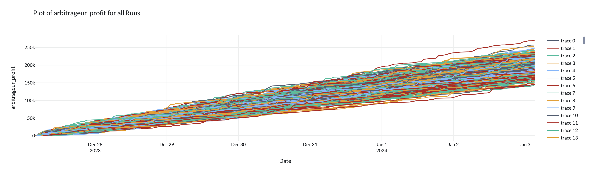
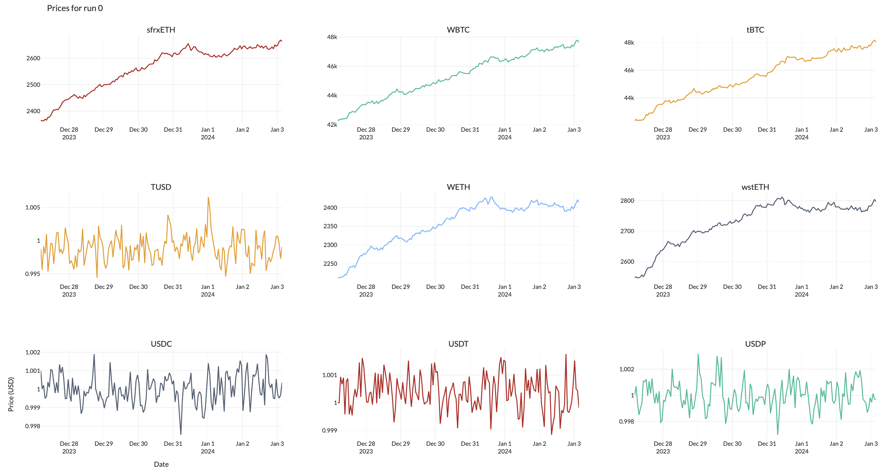
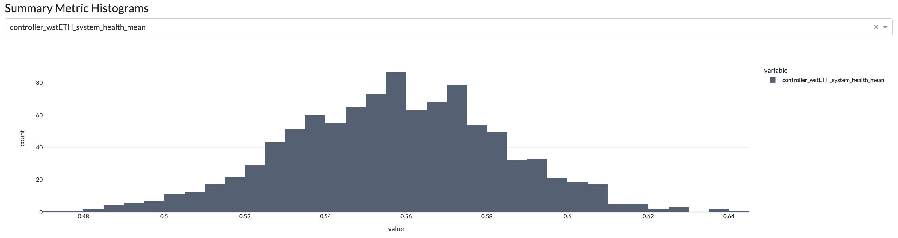
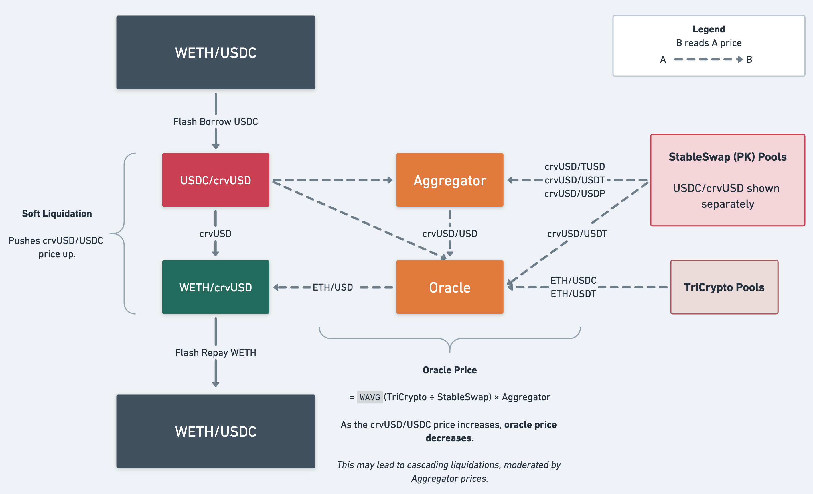

crvusd Risk Modeling
=======================================

[](https://github.com/psf/black)
[](http://mypy-lang.org/)
[](https://github.com/xenophonlabs/crvUSDrisk/actions/workflows/CI.yml/badge.svg)


**Under construction 👷🏽‍♂️**

crvUSD Risk is a tool for Curve’s researchers and developers to test the resiliency of the crvUSD ecosystem under a variety of market conditions.

For a quick introduction to the key agents in our agent-based model and the overall simulation architecture, please refer to the `./notebooks/demo_*` notebooks! 

### Table of Contents

1. [Setup](#setup)
2. [Usage](#usage)
3. [Results](#results)
4. [Conceptual Overview](#conceptual-overview)

*More detailed documentation coming soon.*

# Setup

We use a simple python `venv` for package management. Due to a minor dependency conflict between the [curvesim](https://github.com/curveresearch/curvesim/tree/main) and [crvusdsim](https://github.com/0xreviews/crvusdsim) versions we are using, please follow the below steps for setup:

```
python3 -m venv venv
python -m pip install --upgrade pip
grep -v 'crvusdsim' requirements.txt > temp_requirements.txt
python -m pip install -r temp_requirements.txt
python -m pip install git+https://github.com/Tcintra/crvusdsim@dev --no-deps
source venv/bin/activate
```

Only Python3.11 is guaranteed support.

*We are working on replacing these dependencies with stable releases.*

# Usage

The recommended way to analyze simulation results is via our Plotly Dash app. To run the app:

```bash
python3 -m app.app
```

Alternatively, you may run the simulation via the `scripts/sim.py` script in interactive mode, or follow the instructions in `notebooks/demo_monte_carlo.ipynb` (for many simulations) or `notebooks/demo_sim.ipynb` (for a single simulation).

## Running Local Simulations

Running `./app/app.py` will either run a simulation on your machine, or it will try to read an output `.pkl` object in your root directory (e.g. `sample_output.pkl` as discussed below). 

To run a simulation on your machine, uncomment the relevant lines in `./app/app.py` and optionally edit the arguments to `run_scenario(...)`.

## Viewing Saved Results

We provide sample simulation results for the `baseline` scenario in [this](https://drive.google.com/drive/folders/13f6Z8FHI-NTGIbm67hdHpm2Q_IIq9sIs?usp=sharing) google drive. Please download it into the root directory and ensure you are using local results in `./app/app.py`.

# Results

The results for 1000 runs of the `baseline` scenario are shown below. These are the same results that can be found in the `sample_output.pkl` in [this](https://drive.google.com/drive/folders/13f6Z8FHI-NTGIbm67hdHpm2Q_IIq9sIs?usp=sharing) google drive.


*Arbitrageur Profits*


*Prices for Run 0*


*Histogram of System Health*

# Conceptual Overview

**Research paper:** [link](https://xenophonlabs.com/papers/_INTERNAL__An_ABS_Engine_for_crvUSD.pdf)

One of the primary purposes of crvUSD Risk simulations is to analyze the impact of available crvUSD liquidity on crvUSD liquidations. We explicitly simulate arbitrageurs and liquidators trading against the relevant LLAMMAs and Curve pools using the [curvesim](https://github.com/curveresearch/curvesim/tree/main) and [crvusdsim](https://github.com/0xreviews/crvusdsim) packages. This allows us to understand the impact of liquidity and liquidations themselves on the health of the crvUSD system.


*Liquidation Model*

## Inputs

When running a simulation, we fetch the most updated data for the relevant crvUSD modules, including LLAMMAs, Controllers, StableSwap pools, etc.. We generate prices using empirically-trained Geometric Brownian Motion processes (for collateral) and Ornstein-Uhlenbeck processes (for stablecoins). We also simulate the "external" liquidity for all relevant tokens (please refer to [this repo](https://github.com/xenophonlabs/oneinch-quotes) for more detail on our liquidity model).

## Stress Testing

Inputs are generated according to "Stress Scenario" configurations in `./src/configs/scenarios`. Currently, only the `baseline` scenario is supported.

## Agent Based Modeling

Below is the overview for the ABM architecture.


*ABM Architecture*