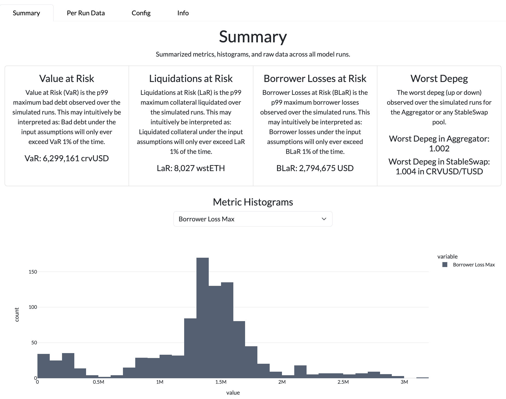

crvusd Risk Modeling
=======================================

[](https://github.com/psf/black)
[](http://mypy-lang.org/)
[](https://github.com/xenophonlabs/crvUSDrisk/actions/workflows/CI.yml/badge.svg)


**Under construction 👷🏽‍♂️**

crvUSD Risk is a tool for Curve’s researchers and developers to test the resiliency of the crvUSD ecosystem under a variety of market conditions. 

### Quick Start

To view the risk dashboard, follow the steps in [Setup](#setup). Then, download some sample results from [this Google Drive folder](https://drive.google.com/drive/folders/13f6Z8FHI-NTGIbm67hdHpm2Q_IIq9sIs?usp=sharing), and run the app:

```python
python3 -m app.app
```

You may also run your own simulations as instructed in [Usage](#usage).

### Table of Contents

1. [Setup](#setup)
2. [Usage](#usage)
3. [Dashboard](#dashboard)
4. [Conceptual Overview](#conceptual-overview)

*More detailed documentation coming soon.*

# Setup

We use a simple python `venv` for package management. Due to a minor dependency conflict between the [curvesim](https://github.com/curveresearch/curvesim/tree/main) and [crvusdsim](https://github.com/0xreviews/crvusdsim) versions we are using, please follow the below steps for setup:

```
python3 -m venv venv
source venv/bin/activate
python3 -m pip install --upgrade pip
grep -v 'crvusdsim' requirements.txt > temp_requirements.txt
python3 -m pip install -r temp_requirements.txt
python3 -m pip install git+https://github.com/Tcintra/crvusdsim@main --no-deps
rm temp_requirements.txt
```

Only Python3.11 is guaranteed support.

*We are working on replacing these dependencies with stable releases.*

# Usage

## Viewing Results

The recommended way to analyze simulation results is via our Plotly Dash app. To run the app:

```bash
python3 -m app.app
```

Simply select to load a results file (`.pkl`), or run your own simulation.

### Viewing Saved Results

We provide sample simulation results for the `baseline` scenario in [this](https://drive.google.com/drive/folders/13f6Z8FHI-NTGIbm67hdHpm2Q_IIq9sIs?usp=sharing) google drive. Please download it into the root directory and ensure you are using local results in `./app/app.py`.

## Running Simulations

### From the Dashboard

Select a `scenario`, `market`, and number of iterations (model runs) for you scenario and click the simulate button. Your terminal will begin to print the logs for the simulation. 

*Simulations may take a long time to finalize; by default, multiprocessing will be applied using all your machine's processors. It is much faster to run simulations directly from the command line.*.

### From the Command Line

Alternatively, you may run a simulation via the `scripts/sim.py` script as follows:

```bash
python3 -m scripts.sim baseline_macro wsteth 100 -mp &> logs/sim.log
```

Make sure to create the `logs` directory to view simulation logs/warnings, or remove the `&> logs/sim.log` redirection.

### In a Notebook

Follow the instructions in `notebooks/demo_monte_carlo.ipynb` to run simulations in a Jupyter notebook or `notebooks/demo_sim.ipynb` to run a single simulation.

# Dashboard

The Risk Dashboard allows the user to analyze the results of a given model run. Ultimately, the dashboard will allow users to compare the results from model runs with different parameter configurations (e.g. Debt Ceilings) to identify parameter improvements for the crvUSD system.

The results for 1000 runs of the `Baseline Macro` scenario (in the Google Drive) are shown below.

### Summary Metrics


*Summary Tab*

### Per-Run Metrics

*Per Run Metrics Tab*

### Per-Run Prices

*Per Run Prices*

### Modeled External Liquidity

*Liquidity*

# Conceptual Overview

**Research paper:** [link](https://xenophonlabs.com/papers/_INTERNAL__An_ABS_Engine_for_crvUSD.pdf)

One of the primary purposes of crvUSD Risk simulations is to analyze the impact of available crvUSD liquidity on crvUSD liquidations. We explicitly simulate arbitrageurs and liquidators trading against the relevant LLAMMAs and Curve pools using the [curvesim](https://github.com/curveresearch/curvesim/tree/main) and [crvusdsim](https://github.com/0xreviews/crvusdsim) packages. This allows us to understand the impact of liquidity and liquidations themselves on the health of the crvUSD system.

For a quick introduction to the key agents in our agent-based model and the overall simulation architecture, please refer to the `./notebooks/demo_*` notebooks!


*Liquidation Model*

## Inputs

When running a simulation, we fetch the most updated data for the relevant crvUSD modules, including LLAMMAs, Controllers, StableSwap pools, etc.. We generate prices using empirically-trained Geometric Brownian Motion processes (for collateral) and Ornstein-Uhlenbeck processes (for stablecoins). We also simulate the "external" liquidity for all relevant tokens (please refer to [this repo](https://github.com/xenophonlabs/oneinch-quotes) for more detail on our liquidity model).

## Stress Testing

Inputs are generated according to "Stress Scenario" configurations in `./src/configs/scenarios`. Currently, only the `baseline` scenario is supported.

## Agent Based Modeling

Below is the overview for the ABM architecture.


*ABM Architecture*