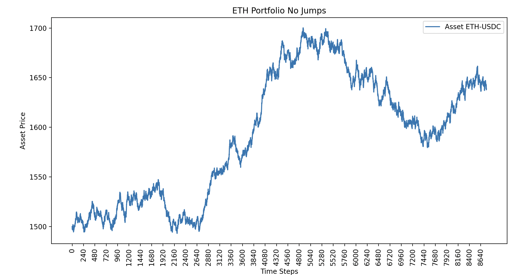
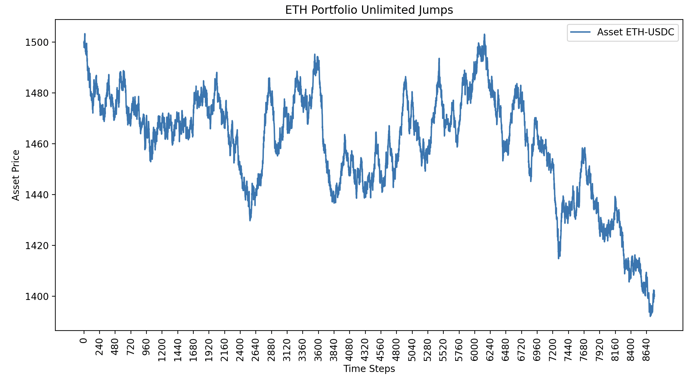
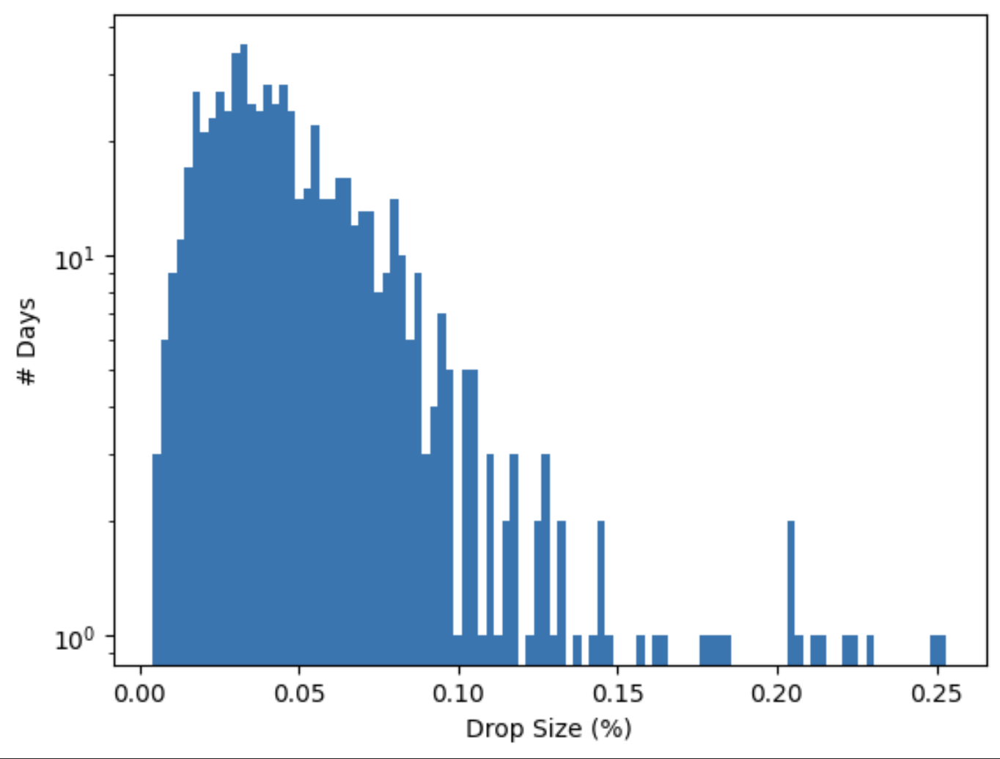
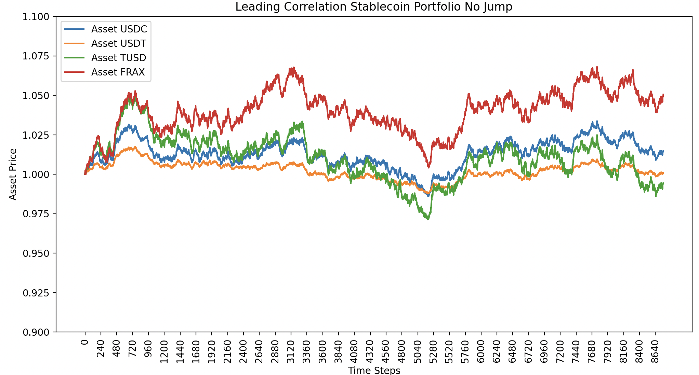
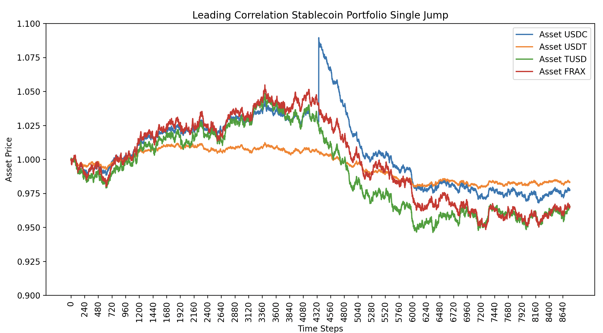
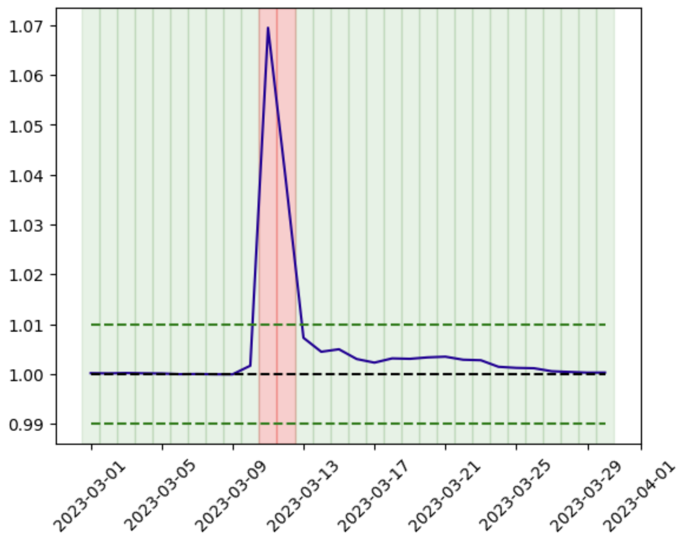

# Model Overview

## Price Path Generation

We are currently modeling cryptoasset prices as path-dependent stochastic processes. This is a well established methodology in fincial analysis. In particular we model two main types of stochastic processes. 

### GBM
The first is for singular assets and is called geometric brownian motion (GBM for short), which presupposes a notion of a drift over time and a lognormally distributed volatility at each time step. This allows us to simulate random paths in assets that follow relatively predictable patterns. The two main equations for a GBM are as follows:

1. $dS_t = \mu S_t \, dt + \sigma S_t \, dW_t$

2. $dW_t = \eta \sqrt{dt}$

The equation $dS_t = \mu S_t \, dt + \sigma S_t \, dW_t$ describes the dynamics of an asset price that follows a Geometric Brownian Motion (GBM). The components of this equation are:

- $S_t$: The price of the asset at time $t$.
- $dS_t$: The infinitesimal change in the asset price at time $t$.
- $\mu$: The drift coefficient, representing the expected return of the asset per unit of time. This reflects the average directional movement of the asset price.
- $\sigma$: The volatility coefficient, representing the standard deviation of the asset's returns. This captures the risk or uncertainty associated with the asset price movements.
- $dt$: An infinitesimal increment of time.
- $dW_t$: The increment of a Wiener process (or standard Brownian motion) at time $t$, introducing randomness into the model. This represents the unpredictable component of the asset price changes.

In this model, the term $\mu S_t \, dt$ accounts for the expected growth rate of the asset, while the term $\sigma S_t \, dW_t$ models the random fluctuations around this trend, reflecting the inherent unpredictability of asset prices in financial markets. The volatility term $\sigma S_t$ suggests that the asset's price volatility is proportionally related to its current level, consistent with the observed behavior of many financial assets.

GBM is a key model in financial mathematics for simulating asset price behaviors, capturing both the stochastic nature of short-term price fluctuations and the long-term trend. It is also foundational in the development of financial derivatives pricing models, such as the Black-Scholes formula.

### Cholesky Decomoposition
The second is called a Cholesky Decomposition and we are using it to model stochastic price paths in multiple assets at once, where those assets may have cross correlations to each other. With regards to cryptoassets, this is often a useful layer of realism for simulation. The Cholesky Decomposition is a matrix factorization technique that decomposes a symmetric positive-definite matrix into the product of a lower triangular matrix and its conjugate transpose. It is expressed as:

$$ A = LL^T $$

where:

- $A$ is the original symmetric positive-definite matrix.
- $L$ is a lower triangular matrix with real and positive diagonal entries.
- $L^T$ is the transpose of $L$.

The decomposition is used for various numerical calculations, such as solving systems of linear equations, inverting matrices, and Monte Carlo simulations. It is particularly useful because it is more efficient and numerically stable than other methods, like the LU decomposition, when dealing with positive-definite matrices.

The process of Cholesky Decomposition involves finding the elements of $L$ using the following formulas:

For the diagonal elements of $L$:
$$ l_{jj} = \sqrt{a_{jj} - \sum_{k=1}^{j-1} l_{jk}^2} $$

For the off-diagonal elements:
$$ l_{ij} = \frac{1}{l_{jj}} \left( a_{ij} - \sum_{k=1}^{j-1} l_{ik} l_{jk} \right) \text{ for } i > j $$

The decomposition is unique; given a particular matrix $A$, there is only one lower triangular matrix $L$ with positive diagonal entries that satisfies the equation $A = LL^T$.

### Scenarios

1. Collateral Assets (e.g. ETH)

Here we can see a sample GBM generated for a potential price path of ETH. We specify a $\mu$, $\sigma$, $T$, and $dt$ for our GBM. We can derive reasonable values for these via historical analysis of directionality and volatility of collateral assets like ETH. 

We can add additional degrees of realistic behavior to our simulated price paths with something referred to as a Merton Jump Diffusion model, which essentially treats these jumps as a Poisson process.  

### Merton Jump Diffusion Model

The Merton Jump Diffusion model extends the classic Black-Scholes model by incorporating sudden asset price jumps. This model is represented by the stochastic differential equation:

$
dS_t = \mu S_t dt + \sigma S_t dW_t + dJ_t S_{t^-1}
$

where $S_t$ is the asset price when the jump occurs, $mu$ is the drift coefficient, $\sigma$ is the volatility, $ dW_t$ is the Wiener process, and $dJ_t$ is the jump process. The jump process $dJ_t$ is defined as:

$
dJ_t = \sum_{i=1}^{N_t} (\gamma_i - 1)
$

Here, $N_t$ is a Poisson process with intensity $\lambda$, and $\gamma_i$ are the jump sizes. The Merton model captures both the continuous market risk and the discrete jump risks in asset pricing.

Additionally we can sample historical distributions of daily price movements to compare the magnitude of daily price drops in our simulated asset prices with historical price drops in assets like ETH to develop a sense of any additional outlier "jumps" we would see in reality that do not occur in vanilla GBM price paths. See the below figure for a histogram of actual ETH price data since January 2022. 

2. Correlated Stablecoins

As per the Cholesky Decomposition, we can also simulate multiple correlated stablecoin prices (for example $1-pegged coins) as shown below. 

3. Stablecoin De-peg

For the most part, stablecoins are fairly mean-reverting. However, we have historically observed a few incidents of temporary de-pegs from the target price. For example the dislocation above peg observed in USDT during the Silicon Valley Bank in March 2023.

Sometimes these "depegs" occur above the target price and sometimes below. Additionally, we often see the market "bounce back" or recover from these price dislocations over a period of $n$ number of days. We can perform an historical analysis on these stablecoin prices to see when prices exit some arbitrarily chosen sensitivity threshold away from the target price (peg) and similarly when the price re-enters a range we would consider to be a mean reversion. 

Above we can see when the price exits the green dotted line region away from $1 and when it subsequently get close enough to $1 again ~4 days later. We can use analysis like this to approximate parameters for when our simulated price paths should recover from jumps. You can also see that while the price gets close to $1 again, it does not recover 100% of the dislocation at first. This is something we also include as a parameter of our price paths (% recovery from jump). 

## External Market Slippage and Price Impact

3. A polished description of the liquidity/slippage analysis you did, and how we are incorporating it into our model. Specifically, would be great to show the regression results on the Univ3 data and a corresponding visualization. This should describe why this approach is reasonable, and discuss some potential limitations/enhancements, ~5 or so paragraphs.

## Borrower and Liquidity Distributions

We have a few strategies we can employ for modeling reasonable distributions of liquidit and debt positions on an AMM or lending platform. LLAMMA is a combination of these two mechanisms so it is worth clarifying the assumptions that are reasonable to hold vs the variables that need to be monitored, analyzed and modeled. For example, it is typically reasonable to assume that loans (or debt positions) are self-replacing a la survival analysis techniques. I.e. for a constant amount of total debt, if individual loan positions are liquidated, repayed, or refinanced, we can assume that another loan of similar size would take its place. Therefore, we primarily have to model the health and volume of loans in aggregate to determine when borrowers are likely to mint/borrow or burn/repay their debt. For further degrees of nuance, we can simulate reasonable fluctuations in bands of LTV/position health, effectively creating buckets or tranches of users who share similar behavioral patterns. 

Also, given arbitrage incentives, we can typically assume that in aggregate the distribution of liquidity on an AMM will tend to center around the current price (as positions centered further outside of current price would be subject to more arbitrage from other traders). Also, for a given amount of liquidity supplied, we can typically assume liquidity positions to also be self-replacing. I.e. when liquidity is added or removed (assuming constant total liquidity supplied) another user would be likely to symmetrically add or remove liquidity. We can therefore primarily concern ourselves with modeling the aggregate amount of liquidity and the overall shape of the distribution of liquidity provided. This leads to the pattern of a liquidity distribution that moves along with oracle price of the collateral asset. This is typically empirically supported by analyses of historical AMM data. 

